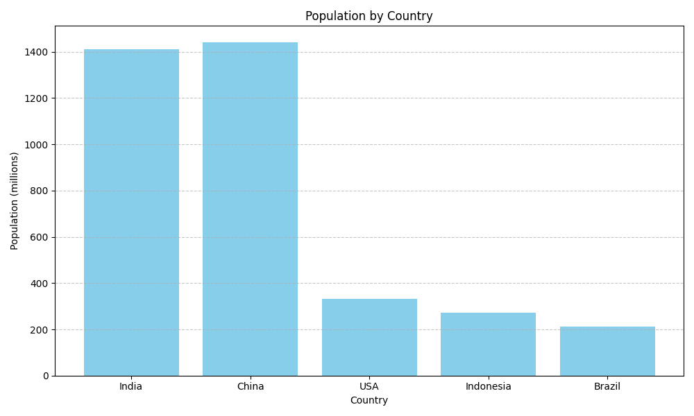

# Task 01 - Population Distribution Bar Chart

This is Task-01 for the Prodigy Internship (Data Science Track).

## Objective
Create a bar chart to visualize the population distribution of different countries.

## Tools Used
- Python
- Matplotlib

## Output
Below is the bar chart generated:

